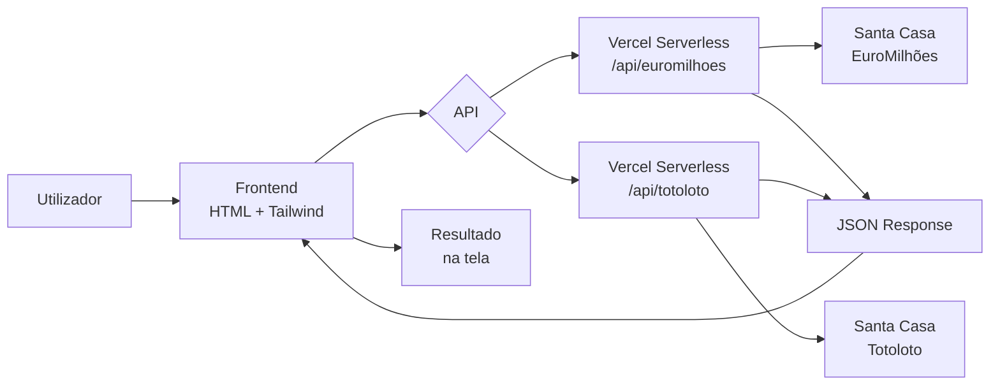

<p align="center">
  
  
  
  
  
  
</p>

<br>

<p align="center">
  <picture>
    <source media="(prefers-color-scheme: dark)" srcset="https://img.shields.io/badge/DashLoto-🎰-0ea5e9?style=for-the-badge&labelColor=1e293b&fontColor=white">
    
  </picture>
</p>

<p align="center">
  <b>Verificador de Resultados — Euromilhões & Totoloto</b><br>
  Resultados oficiais em tempo real com valores de prémios extraídos do site da Santa Casa.
</p>

<br>

## ✨ Funcionalidades

<table>
<tr>
<td width="50%">

### 🎯 Verificação Individual
- Insere a tua chave e descobre o prémio
- Suporte para Euromilhões e Totoloto
- Acertos destacados visualmente

### ⭐ Múltiplos Favoritos
- Guarda até **5 chaves** (Euromilhões) ou **10 chaves** (Totoloto)
- Persistência no `localStorage`
- Carregar e ver rapidamente

### ✅ Verificar Todas
- Verifica todas as chaves guardadas de uma só vez
- Resultados lado a lado com prémios individuais
- Interface clara e organizada

</td>
<td width="50%">

### 💰 Prémios Reais
- Valores extraídos do site oficial sorteio a sorteio
- Sem estimativas — o valor exato do prémio
- Jackpot detetado automaticamente

### 🔄 Reembolso Totoloto
- Acertar apenas no **Nº da Sorte** devolve **€2**
- Equivalente ao valor da aposta

### 🛡️ Fallback Inteligente
- Dados de exemplo quando o site está indisponível
- A app nunca fica sem resposta

</td>
</tr>
</table>

---

## 🎮 Jogos Suportados

| Jogo | Números | Estrelas / Nº Sorte | Máx. Chaves |
|:-----|:-------:|:-------------------:|:-----------:|
| **Euromilhões** | 5 (1–50) | 2 (1–12) | 5 |
| **Totoloto** | 5 (1–49) | 1 (1–13) | 10 |

---

## 🏆 Tabela de Prémios

### Euromilhões

| Prémio | Acerto |
|:-------|:-------|
| 🥇 **1.º Prémio (Jackpot)** | 5 Números + 2 Estrelas |
| 🥈 2.º Prémio | 5 Números + 1 Estrela |
| 🥉 3.º Prémio | 5 Números |
| 4.º Prémio | 4 Números + 2 Estrelas |
| 5.º Prémio | 4 Números + 1 Estrela |
| 6.º Prémio | 3 Números + 2 Estrelas |
| 7.º Prémio | 4 Números |
| 8.º Prémio | 2 Números + 2 Estrelas |
| 9.º Prémio | 3 Números + 1 Estrela |
| 10.º Prémio | 3 Números |
| 11.º Prémio | 1 Número + 2 Estrelas |
| 12.º Prémio | 2 Números + 1 Estrela |
| 13.º Prémio | 2 Números |

### Totoloto

| Prémio | Acerto |
|:-------|:-------|
| 🥇 **1.º Prémio (Jackpot)** | 5 Números + Nº da Sorte |
| 🥈 2.º Prémio | 5 Números |
| 🥉 3.º Prémio | 4 Números |
| 4.º Prémio | 3 Números |
| 5.º Prémio | 2 Números |
| 💸 **Reembolso** | Nº da Sorte (€2) |

---

## 🏗️ Arquitetura



---

## 📁 Estrutura do Projeto

```
DashLoto/
├── 📄 index.html            # Frontend — interface principal
├── 🎨 styles.css             # Estilos complementares ao Tailwind
├── ⚡ app.js                 # Lógica JavaScript da aplicação
│
├── 📂 api/
│   ├── 🇪🇺 euromilhoes.js    # Serverless: scraping Euromilhões
│   └── 🇵🇹 totoloto.js       # Serverless: scraping Totoloto
│
├── 📦 package.json           # Dependências (axios, cheerio)
├── ⚙️ vercel.json            # Configuração de deploy Vercel
└── 📖 README.md              # Documentação
```

---

## 🚀 Desenvolvimento Local

### Pré-requisitos

- **Node.js** 18+
- **Vercel CLI** — `npm i -g vercel`

### Setup

```bash
# Clonar
git clone https://github.com/Jvagarinho/DashLoto.git
cd DashLoto

# Instalar dependências
npm install

# Iniciar servidor local (http://localhost:3000)
vercel dev
```

---

## 🌐 Deploy na Vercel

```bash
vercel --prod
```

O deploy é automático se tiveres o repositório ligado à Vercel.

---

## ⚙️ API — Formato de Resposta

### `GET /api/euromilhoes`
### `GET /api/totoloto`

```json
{
  "numbers": [6, 16, 19, 34, 41],
  "stars": [4],
  "date": "20/05/2026",
  "prizes": {
    "5+0": 25270.12,
    "4+0": 407.49,
    "3+0": 5.15,
    "2+0": 2.16,
    "0+1": 2
  }
}
```

---

## ⚠️ Notas

- O scraping pode falhar se a Santa Casa alterar a estrutura do HTML — os parsers usam seletores específicos (`ul.colums`, `div.betMiddle`)
- As chaves favoritas são guardadas no **`localStorage`** do navegador — não são partilhadas entre dispositivos nem persistidas em servidor
- Esta aplicação é apenas para **fins informativos**. Verifica sempre os resultados oficiais em [jogossantacasa.pt](https://www.jogossantacasa.pt)

---

<p align="center">
  Feito com ❤️ em Portugal<br>
  <sub>DashLoto © 2026</sub>
</p>
